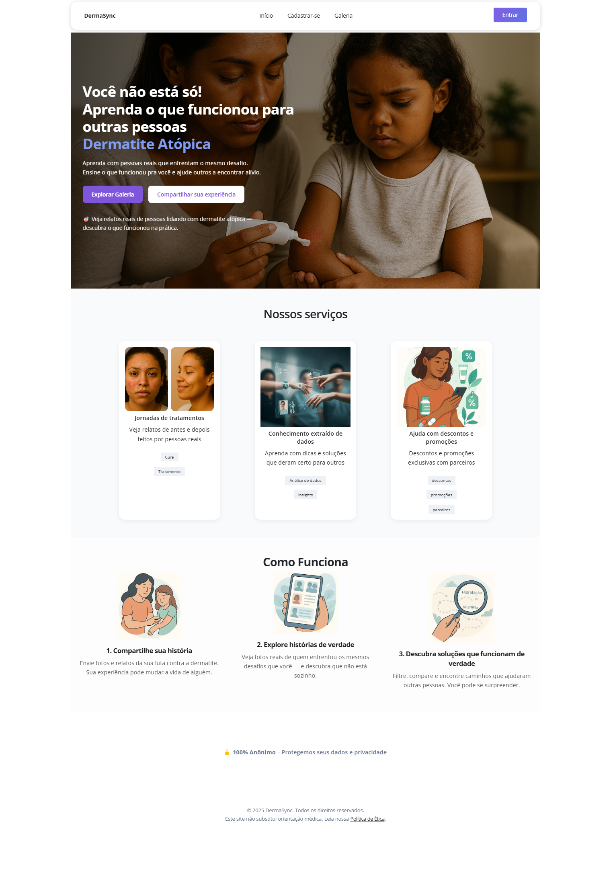

# DermaSync

DermaSync is a collaborative platform for people dealing with atopic dermatitis.

It features:

- 🖼️ A gallery with filterable labels (age, gender, body region)
- 📤 Upload of user-submitted personal journeys (before, during, after)
- 🤖 LLM integration for extracting insights from real user testimonials
- 🔒 A moderator/admin panel with role-based access (Firebase Auth)
- ⚙️ Back-end integration via Python (FastAPI) on Google Cloud Run
- 📦 Firebase Hosting + Firestore + Storage
- 🎨 Custom UI based on Argon Dashboard and Vue 3

---

## 🔗 Live Preview

👉 [https://www.dermasync.com.br](https://www.dermasync.com.br)

---

## ⚠️ License

This project is **not open-source**. It is published only for technical demonstration purposes.

> See [LICENSE.md](./LICENSE.md) for more details.

---

## 👨‍💻 Technologies

- Vue.js 3 + Vite
- Firebase (Auth, Firestore, Hosting, Storage)
- FastAPI (Python) + Google Cloud Run
- SCSS + Argon Design System

---

## 📸 Screenshots

Here are some screenshots showcasing the platform's features:
- User gallery with filterable labels
- Upload interface for personal journeys
- Admin panel with role-based access
- Insights powered by LLM integration
- Custom UI built with Argon Design System
- Responsive design across devices
- Backend integration with FastAPI
- Firebase-hosted services
- Google Cloud Run deployment
- And more! Screenshots

- Vue.js 3 + Vite
- Firebase (Auth, Firestore, Hosting, Storage)
- FastAPI (Python) + Google Cloud Run
- SCSS + Argon Design System

    

---

## 📫 Contact

Jefferson Leandro  
📧 jeffersonleandro.dev@gmail.com  
🌐 [linkedin.com/in/jeffersonleandro](https://linkedin.com/in/jeffersonleandro)
